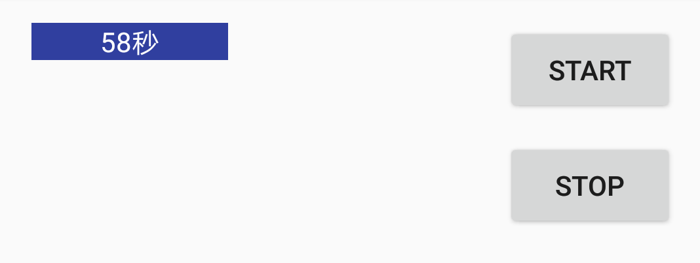
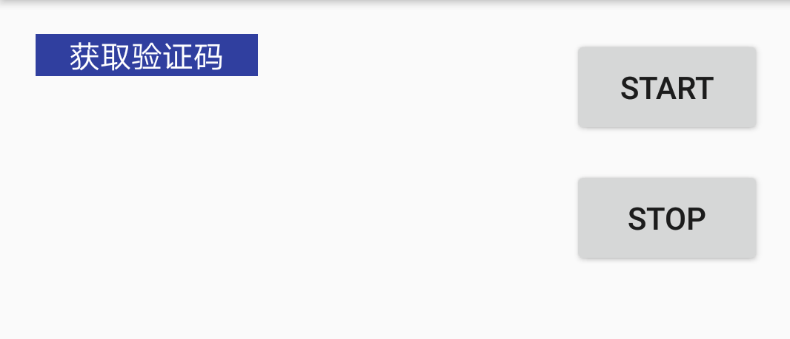

# security-code#
自定义Button的一个验证码按钮

  >private VerificationCodeButton mVerificationCodeButton;

  >mVerificationCodeButton = (VerificationCodeButton) findViewById(R.id.bnt_time);
  //创建view 直接setOnClickListener就行
  >mVerificationCodeButton.setOnClickListener(new View.OnClickListener() {
  >            @Override
  >            public void onClick(View v) {
  >                Toast.makeText(MainActivity.this, "发送成功", Toast.LENGTH_SHORT).show();
  >            }
  >        });

  //或者在别的地方调用start 就可以开始倒计时
  > mVerificationCodeButton.start();

  //然后stop可以暂停
  > mVerificationCodeButton.stop();

   //最后需要在onDestroy中调用stop，防止内存泄露
  > mVerificationCodeButton.stop();